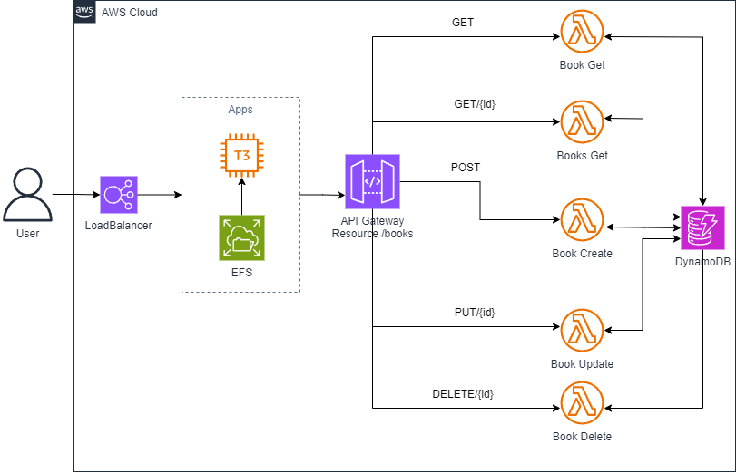

# Dashboard
Dashboard from  Device, you must be set from the database NoSQL.

# Architecture

## Method POST
`tambahkan code berikut pada mappings template di integration request` 
`$input.json('$')`
## Method PUT berdasarkan {id}
`Update berdasarkan id (/books/{id}/GET` 
`tambahkan code berikut pada mappings template di integration request` 
`{
  "body": $input.json('$'),
  "pathParameters": {
    "id": "$input.params('id')"
  }
}`
## Method GET berdasarkan {id}
`GET berdasarkan id (/books/{id}/GET` 
`tambahkan code berikut pada mappings template di integration request` 
`{
  "body": $input.json('$'),
  "pathParameters": {
    "id": "$input.params('id')"
  }
}
`
## Method DELETE berdasarkan {id}
`tambahkan code berikut pada mappings template di integration request` 
`{
  "pathParameters": {
    "id": "$input.params('id')"
  }
}
`
# Application
## Install nodejs
`curl -fsSL https://rpm.nodesource.com/setup_21.x | sudo bash -` 
`sudo yum install -y nodejs git amazon-efs-utils`

## Mounting EFS

### Using EFS Mount Helpher:
`sudo mount -t efs -o tls yourEFS:/ efs`

### Using NFS Client:
`sudo mount -t nfs4 -o nfsvers=4.1,rsize=1048576,wsize=1048576,hard,timeo=600,retrans=2,noresvport yourefs:/ efs` 

## Install Dependencies
`npm install`

# Envinronment Variable
Setting the environment variable on your path application, use the name .env, and set the variable name on the instruction below: 
`API_URL=set your API Gateway URL` 
`EFS_LOG_PATH=set your path EFS`

# Command run application
`npm run start-prod`

